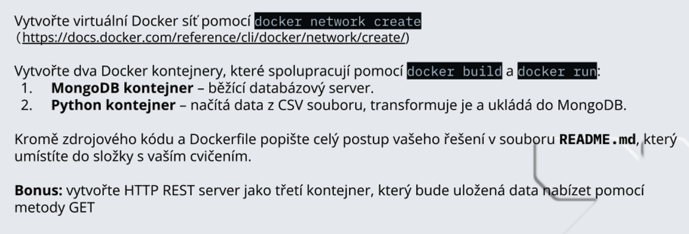

# Lekcia 10: Praktické cvičenie


> [!NOTE]
> Cvičenie splnené pomocou Copilota

> [!TIP]
> V mojom prípade som namiesto **Docker** použil **Podman** nakoľko ho používame v práci.
> 
> **[The best free & open source container tools](https://podman.io/)**

# Inicializácia docker kontainerov

- **Otvorte Windows terminal a vložte nasledujúci príkaz:**

```bash
 podman compose -f "docker-compose.yml" -p "cvicenie_l10" up -d
```
alebo

```bash
 docker-compose -f "docker-compose.yml" -p "cvicenie_l10" up -d
```

# Import CSV cez Streamlit UI
 
 - **URL**: [localhost:8501](http://localhost:8501/)

 - Cez **Browse files** nahrajte CSV súbor obsahujúci hlavičku:
```
sensor_id, temperature, humidity, pressure, light_level, air_quality_index, location, timestamp
```

> [!TIP]
> Testovací súbor **sensor_test_5mb.csv** je uložený na GitHube

- Ak bol súbor úspešne nahraný, kliknite na **Importovať dáta do MongoDB** 

# Prehľad Flask REST API - Senzorové dáta

## Základné informácie
- **Server**: Flask REST API pre senzorové dáta
- **Port**: 8080
- **Host**: 0.0.0.0 (všetky interfejsy)
- **Databáza**: MongoDB
- **Kolekcia**: sensors

## Konfigurácia
- **MONGO_HOST**: localhost (default)
- **MONGO_PORT**: 27017 (default)
- **DB_NAME**: robot_dreams_db (default)
- **COLLECTION_NAME**: sensors (default)

---

## API Endpointy

### 1. Health Check
**`GET /health`**
- **Popis**: Overenie, že API server beží
- **Parametre**: Žiadne
- **Odpoveď**: 
```json
{
    "status": "OK",
    "message": "Senzorové API beží správne",
    "timestamp": "2025-11-09T10:30:00"
}
```

---

### 2. Pridanie senzorových dát
**`POST /sensor`**
- **Popis**: Pridanie nových senzorových dát
- **Content-Type**: application/json
- **Povinné polia**: `sensor_id`
- **Voliteľné polia**: `air_quality_index`, `humidity`, `light_level`, `location`, `presure`, `temperature`, `timestamp`
- **Príklad requestu**:
```json
{
      "air_quality_index": 103,
      "humidity": 48.7,
      "light_level": 423,
      "location": "server_room",
      "pressure": 995.6,
      "sensor_id": "motion_51",
      "temperature": 20.8,
      "timestamp": "2025-11-08T22:54:26.049Z"
    }
```
- **Odpoveď (201)**:
```json
{
    "message": "Senzorové dáta úspešne uložené",
    "sensor_id": "motion_51",
    "id": "673f5a4b2c8d6e1234567890"
}
```

---

### 3. Získanie dát konkrétneho senzora
**`GET /sensor/<sensor_id>`**
- **Popis**: Získanie dát konkrétneho senzora podľa ID
- **Parametre**: `sensor_id` (v URL)
- **Príklad**: `GET /sensor/motion_51`
- **Odpoveď (200)**:
```json
{
  "air_quality_index": 103,
  "humidity": 48.7,
  "light_level": 423,
  "location": "server_room",
  "pressure": 995.6,
  "sensor_id": "motion_51",
  "temperature": 20.8,
  "timestamp": "2025-11-08T22:54:26.049Z"
}
```
- **Chyba (404)**: Ak senzor neexistuje

---

### 4. Získanie všetkých senzorov
**`GET /sensors`**
- **Popis**: Získanie zoznamu všetkých senzorových dát
- **Query parametre**:
  - `limit` (voliteľný): Počet záznamov (max 100, default 20)
  - `location` (voliteľný): Filter podľa lokácie
- **Príklad**: `GET /sensors?limit=10&location=bratislava`
- **Odpoveď**:
```json
{
    "sensors": [...],
    "count": 10,
    "total_count": 150,
    "limit": 10
}
```

---

### 5. Vyhľadávanie senzorov
**`GET /sensors/search`**
- **Popis**: Pokročilé vyhľadávanie senzorov podľa parametrov
- **Query parametre**:
  - `location`: Lokácia senzora
  - `min_temp`: Minimálna teplota
  - `max_temp`: Maximálna teplota
  - `min_humidity`: Minimálna vlhkosť
  - `max_humidity`: Maximálna vlhkosť
- **Príklad**: `GET /sensors/search?location=server_room&min_temp=20&max_temp=25`
- **Odpoveď**:
```json
{
    "sensors": [...],
    "count": 5,
    "query": {
        "location": "server_room",
        "temperature": {"$gte": 20.0, "$lte": 25.0}
    }
}
```

---

### 6. Zmazanie senzora
**`DELETE /sensor/<sensor_id>`**
- **Popis**: Zmazanie senzorových dát podľa ID
- **Parametre**: `sensor_id` (v URL)
- **Príklad**: `DELETE /sensor/motion_51`
- **Odpoveď (200)**:
```json
{
    "message": "Senzor 'motion_51' bol úspešne zmazaný"
}
```
- **Chyba (404)**: Ak senzor neexistuje

---

### 7. Hromadné pridávanie senzorov
**`POST /sensors/bulk`**
- **Popis**: Hromadné pridávanie viacerých senzorových dát naraz
- **Content-Type**: application/json
- **Formát**: JSON array so senzormi
- **Príklad requestu**:
```json
[
    {
        "sensor_id": "motion_51",
        "temperature": 22.5,
        "humidity": 65.0,
        "location": "bratislava"
    },
    {
        "sensor_id": "SENS002", 
        "temperature": 18.2,
        "humidity": 70.0,
        "location": "kosice"
    }
]
```
- **Odpoveď (201)**:
```json
{
    "message": "Úspešne pridaných 2 senzorov",
    "count": 2
}
```

---

### 8. Štatistiky senzorov
**`GET /sensors/stats`**
- **Popis**: Základné štatistiky o senzorových dátach
- **Parametre**: Žiadne
- **Odpoveď**:
```json
{
  "averages": {
    "_id": null,
    "avg_humidity": 55.34109714285714,
    "avg_pressure": 999.9641014285713,
    "avg_temperature": 21.49882
  },
  "locations": [...],
  "total_sensors": 70000
}
```

---

## Chybové kódy

### HTTP Status kódy:
- **200**: OK - Úspešný request
- **201**: Created - Úspešne vytvorené
- **400**: Bad Request - Chybný request alebo chýbajúce dáta
- **404**: Not Found - Endpoint alebo senzor nebol nájdený
- **405**: Method Not Allowed - HTTP metóda nie je povolená
- **500**: Internal Server Error - Interná chyba servera

### Error Handler Endpointy:
- `404` - Endpoint nebol nájdený
- `405` - HTTP metóda nie je povolená  
- `500` - Interná chyba servera

---

## Spustenie servera

 - **Api server sa spustí na: `http://localhost:8080`**

### Logované informácie pri spustení:
- Dostupné endpointy
- MongoDB pripojenie
- Konfigurácia databázy